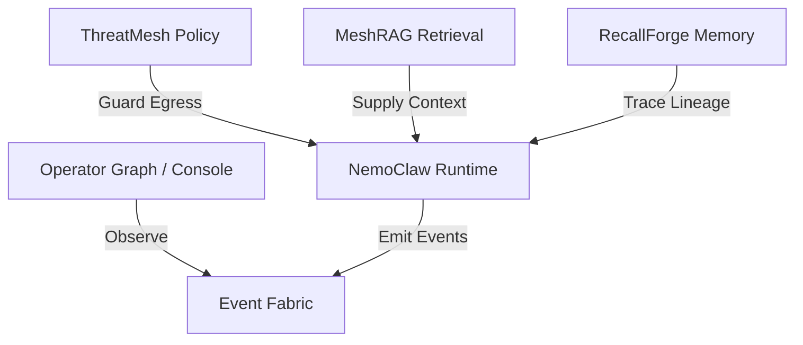

<!-- SPDX-FileCopyrightText: Copyright (c) 2026 NVIDIA CORPORATION & AFFILIATES. All rights reserved. -->
<!-- SPDX-License-Identifier: Apache-2.0 -->

# 🌌 Nautilus: Deterministic Operational AI Infrastructure Platform

[](https://opensource.org/licenses/Apache-2.0)
[](https://nodejs.org)
[](#execution-environment-truth)

> Nautilus is the platform identity for deterministic operational AI infrastructure. **NemoClaw** serves as the runtime and orchestration engine inside the platform.

Nautilus bridges the gap between raw AI potential and production-grade reliability. Instead of treating AI agents as black boxes, Nautilus provides the core blueprints, boundaries, and validation networks needed to execute AI workloads deterministically, securely, and transparently.

---

## 🎯 Why Nautilus Exists

In the era of autonomous agents, traditional software patterns break down. AI decisions are often non-deterministic, opaque, and difficult to audit. Nautilus shifts the paradigm from **unconstrained AI autonomy** to **governed, deterministic alignment**:

*   **State Separation:** Absolute segregation between the execution plane (where models think) and the control plane (where policies are enforced).
*   **Zero Theatre:** We do not guess or optimize telemetry. If a service is degraded, Nautilus reports it explicitly.
*   **Auditable Provenance:** Every action produces a cryptographic execution receipt, making agent operations replayable and auditable.
*   **Fail-Closed Policy:** Security is not an afterthought. The ThreatMesh enforces strict egress and capability boundaries at the kernel level.

---

## 🏗️ Platform Architecture

Nautilus is composed of five specialized core pillars, wired together via a unified Event Fabric:



*   **NemoClaw Runtime** (`src/`, `nemoclaw/src/`, `bin/`): The core orchestration engine executing OpenClaw sandboxes with NVIDIA local & remote inference.
*   **RecallForge** (`core/recallforge/`): The provenance-based memory system that ensures context remains auditable, traceable, and free of drift.
*   **OperatorGraph** (`core/operatorgraph/`, `operator-console/`): The visualization and telemetry matrix providing operators with real-time, inspectable state traces.
*   **ThreatMesh** (`core/threatmesh/`): The security perimeter containing sandboxes, validating network policies, and guarding API boundaries.
*   **MeshRAG** (`core/meshrag/`): The deterministic context retrieval engine that serves factual lookups with strict confidence scoring.
*   **Canonical Event Fabric** (`core/event-fabric/contracts.ts`): The event bus unifying communication across all pillars.

> [!NOTE]
> Read the complete target architecture and evolution plan in [docs/nautilus/platform-evolution.md](docs/nautilus/platform-evolution.md).

---

## ⚡ Quick Start: Experience the Gold Standard

Get Nautilus running locally in minutes. Ensure Docker is running and you are on a POSIX-compliant environment (Linux, macOS, or WSL2).

```bash
# 1. Clone & install root dependencies
npm install

# 2. Build the NemoClaw runtime plugin
cd nemoclaw && npm install && npm run build && cd ..

# 3. Verify the installation
npm run verify:release
```

Once built, verify the core platform mechanics with the built-in MVP simulation:
```bash
# Run the complete Nautilus Golden Path execution flow
npm run nautilus:golden-path
```

---

## 🚀 The Nautilus M1 Truth Loop

Nautilus implements the **M1 Truth Loop** (located in `src/lib/core/nautilus-truth-loop.ts`), which enforces execution-plane invariants and emits trace telemetry:

1.  **State-Transition Telemetry:** Emits structured Event Fabric envelopes for `execution.started`, `policy.evaluated`, and terminal outcomes.
2.  **Fail-Closed Security:** ThreatMesh triggers immediate containment and denies execution if the policy engine becomes unreachable.
3.  **Trace Correlation:** OperatorGraph binds spans via unique `correlationId` and `traceId` attributes.
4.  **No-Theatre Context:** MeshRAG explicitly defaults to `unavailable` rather than generating hallucinated fallbacks when retrieval fails.
5.  **Audit-Ready Recall:** RecallForge writes memory structures alongside their required completion receipts.

---

## 🗺️ Open Frontiers: Join the Build!

Nautilus is an open-source initiative designed for both **human developers** and **AI coding agents**. Below is our forward-looking roadmap. We actively welcome PRs, RFCs, and discussions for these modules:

### 🧩 Core Backlog & Contribution Opportunities

| Module | Goal | Current Status | How to Join |
|:---|:---|:---|:---|
| **Heterogeneous Routing** | Smart routing of tasks across local NIMs and cloud providers based on cost/latency. | `Opt-in` via environment flags. | Extend `src/lib/control-plane/governed-provider-routing.ts`. |
| **Distributed Replay** | Replaying execution traces across multi-node clusters with exact-state consensus. | `Planned` | Draft an RFC in `docs/architecture/` proposing consensus schemas. |
| **Durable Evidence Storage** | Cryptographically signed database backends for RecallForge memory. | `Scaffolded` | Implement SQL/KV adapters under `core/recallforge/`. |
| **GPU Telemetry Parser** | High-fidelity hardware metrics parsing for dynamic load-balancing. | `Scaffolded` | Build real-time parser integrations under `docs/architecture/gpu-telemetry.md`. |
| **Unified Device Registry** | System for dynamic discovery and capability attestation of local GPUs. | `Not Implemented` | Model the schema in `docs/architecture/device-registry.md`. |

---

## 🛠️ Verification Command Center

Keep the repository green and release-ready using our local verification scripts:

*   `npm run verify:core` — Executes core suite typechecks, linters, and checks import boundaries.
*   `npm run verify:release` — The ultimate pre-flight checklist. Verifies changelog hygiene, lints, types, and chaos resilience.
*   `npm run verify:all` — Strict mode validation, ensuring all host tools and dependencies are aligned.
*   `npm run nautilus:verify` — Executes all MVP smoke-testing scenarios (replay, proofpacks, and telemetry fallbacks).

---

## 🤝 Community & Collaboration

We are building a community of systems engineers, AI alignment researchers, and developer-advocates.

*   **Read the Guidelines:** Dive into our [CONTRIBUTING.md](CONTRIBUTING.md) to understand our engineering expectations.
*   **Learn the Rules:** See [docs/architecture/REPO_INVARIANTS.md](docs/architecture/REPO_INVARIANTS.md) for our code standards.
*   **Security Disclosures:** Please report security issues privately according to the steps in [SECURITY.md](SECURITY.md).
*   **AI Agent Friendly:** If you are pair-programming with an agent, refer them to [AGENTS.md](AGENTS.md) to load repository context and patterns directly.

Let's build a deterministic future for operational AI together! 🌌
